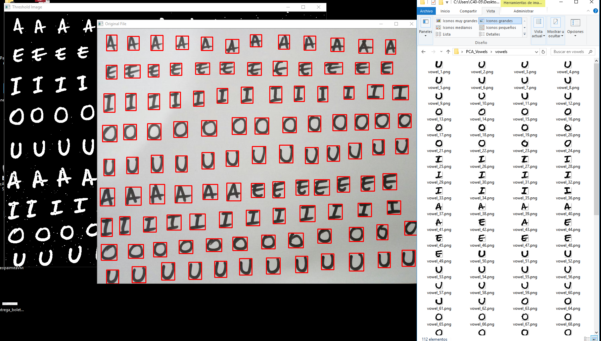
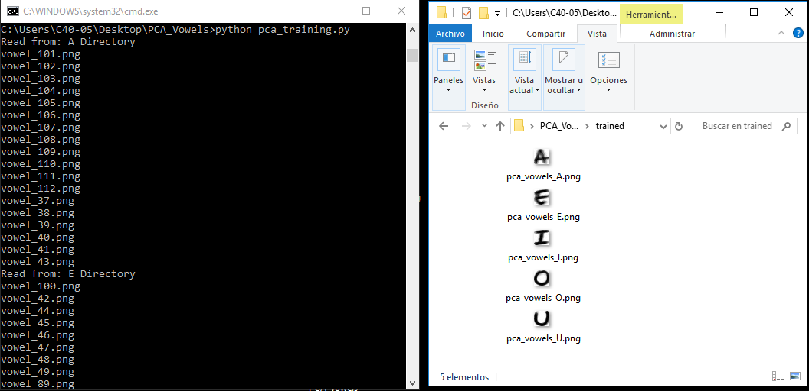
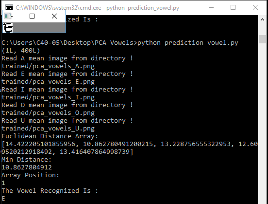

# PCA_Vowels
Perform PCA (Principal Component Analysis) -  for vowel recognition using OpenCV 

# Usage:

##  Extract and crop single vowels images from an array image

- python extract_vowels.py

##  Perform PCA (Principal Component Analysis) for vowel images

- python pca_training.py

##  Using PCA (Principal Component Analysis) for vowel prediction in images 

- python prediction_vowel.py

